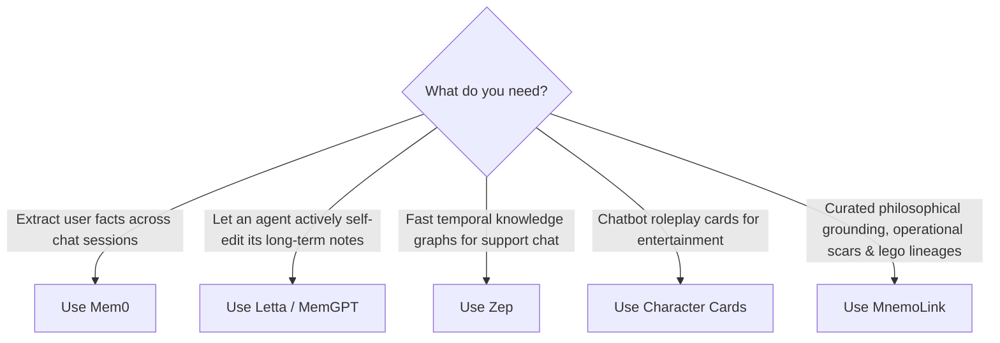

# Comparison: MnemoLink vs. Alternatives

**MnemoLink** is an open-source framework and curated registry serving the **mnemonic industry for information processors** (AI agents, autonomous UAVs, edge robotics, smart appliances, and future brain-to-machine interfaces).

It decouples intelligence from experiential context by packaging, versioning, and dynamically assembling **Personas** (philosophical axioms), **Memories** (operational scars), and **Lineages** (lego-brick chronological backstories).

This document clarifies how MnemoLink compares to other approaches in the AI memory and identity landscape, including **Mem0**, **Letta (MemGPT)**, **Zep**, **Character Cards (V2)**, and **LangChain / CrewAI Memory**.

---

## Architectural Dimension Comparison

| Dimension | **MnemoLink** | **Mem0** | **Letta / MemGPT** | **Zep** | **Character Cards V2** | **LangChain Memory** |
| :--- | :--- | :--- | :--- | :--- | :--- | :--- |
| **Primary Paradigm** | **Curated Mnemonic Products** | Dynamic KV user factoid extraction | OS-style self-editing virtual memory | Conversational temporal knowledge graphs | Roleplay dialogue prompts | Chat history buffers & vector summaries |
| **Epistemic Depth** | **Bedrock philosophy, cognitive priors, axioms** | Superficial user preferences ("likes coffee") | Agent-driven self-updating text blocks | Semantic entity relations | Flat character traits & greetings | Raw token history |
| **Episodic Scars** | **Digital twin & synthetic battle-tested scars** | None | Ephemeral session notes | Message history | None | Session history |
| **Lego Lineage Bridging** | **Dynamic causal connective tissue between memories** | None | None | None | None | None |
| **Distribution & Packaging** | **Installable, versioned, portable Python bundles** | SaaS API / Cloud DB | Database snapshots | Server daemon / Cloud DB | PNG / JSON flat cards | In-memory class instances |
| **Discovery Hierarchy** | **3-Tier** (`Project` $\to$ `User` $\to$ `Bundled Wheel`) | Remote DB endpoint | Remote DB endpoint | Remote DB endpoint | Manual file loading | None |
| **Target Information Processors** | AI Agents, UAVs, Robots, Appliances, BMIs | Conversational web bots | Conversational agents | Customer support bots | Roleplay chat frontends | Python LLM chains |
| **Zero-Bloat Runtime** | **Yes** (100% offline, zero mandatory daemons) | Requires Vector DB / API | Requires Server / DB | Requires Server / DB | Local file | In-memory |

---

## 1. MnemoLink vs. Mem0 (Embedchain)

[Mem0](https://github.com/mem0ai/mem0) is a personalized memory layer for AI applications designed to extract and persist user facts across conversations (e.g., *"User prefers vegetarian meals"*, *"User works in Chicago"*).

### Key Differences
* **Factoid Extraction vs. Experiential Scars**: Mem0 is fundamentally an *accumulator of user preferences* extracted via background LLM calls and stored in vector indexes. MnemoLink does not focus on tracking what the user likes; it equips the *processor itself* with hard-earned operational scars (e.g., a catastrophic $4.2M trial loss from an unanchored semicolon, or a near-fatal UAV microburst stall) that fundamentally alter how the agent reasons under pressure.
* **Philosophical Anchoring**: Mem0 has no concept of philosophical worldviews, ethical taboos, or cognitive priors. MnemoLink provides deep epistemic foundations (e.g. *"Words are imperfect vessels for mutual intent; unanchored punctuation cannot overrule bilateral equity"*), ensuring models do not behave like sycophantic chameleons.

---

## 2. MnemoLink vs. Letta (formerly MemGPT)

[Letta](https://github.com/letta-ai/letta) treats LLM context windows like operating system RAM, providing virtual memory management where an agent uses tool calls to self-edit its core, archival, and working memory blocks.

### Key Differences
* **OS Memory Management vs. Packaged Mnemonic Products**: Letta is an *agent memory operating system* where the agent actively decides what to remember and forget through tool invocation. MnemoLink is a *content, packaging, and resolution standard* for curated, reusable mnemonic products. You can bundle a verified set of 20 legal battle scars and ship them as an installable package (`pip install`) across thousands of independent agent runtimes.
* **Lego-Brick Lineage Synthesis**: Letta stores archival memories as unlinked textual strings in a database. MnemoLink's `LineageBuilder` acts like a dynamic lego assembler: it takes disparate memories and weaves associative bridges, chronological progression, and causal continuity, constructing an authentic experiential identity.

---

## 3. MnemoLink vs. Zep

[Zep](https://github.com/getzep/zep) is a fast conversational memory store that constructs temporal knowledge graphs from user chat sessions.

### Key Differences
* **Infrastructure Footprint**: Zep is a server daemon requiring external databases, Docker containers, and cloud or local service orchestration. MnemoLink is a **zero-dependency, Python-native library** that runs in-process with zero network overhead, making it immediately embeddable into edge robotics, UAV flight computers, and local Python scripts.
* **Session Recall vs. Pre-trained Operational Instincts**: Zep answers *"What did the user mention three sessions ago about their budget?"* MnemoLink answers *"How does this autonomous drone instinctively recover when blinded by low-angle dawn solar glare?"*

---

## 4. MnemoLink vs. Character Cards (V2 / SillyTavern / TavernAI)

The [Character Card V2 Spec](https://github.com/malfoys/character-card-spec-v2) is a popular open standard for roleplay chatbots, packaging character attributes, greetings, and dialogue examples into JSON or PNG metadata chunks.

### Key Differences
* **Superficial Roleplay vs. Deep Epistemology**: Character cards are largely engineered for creative storytelling and conversational entertainment (*"You are Captain Jack, a witty pirate who drinks rum"*). MnemoLink is engineered for **rigorous operational information processors**—grounded in epistemology, sensor uncertainty, legal liability, and physical constraints.
* **Universal Model Adapters & Resolution Hierarchy**: Character cards require manual downloading and loading in specialized web interfaces. MnemoLink features **hierarchical 3-tier path discovery** (`project` $\to$ `user` $\to$ `bundled wheel`) and **universal runtime adapters** (Anthropic Claude, OpenAI, Google Gemini, Ollama Modelfiles, ARPA Rooms, and Skillware).

---

## 5. MnemoLink vs. LangChain / CrewAI Memory

Frameworks like [LangChain](https://python.langchain.com/) and [CrewAI](https://github.com/crewAIInc/crewAI) provide conversation memory abstractions such as `ConversationBufferMemory`, `VectorStoreRetrieverMemory`, and agent `backstory` strings.

### Key Differences
* **Beyond Free-Form Text**: In CrewAI or LangChain, an agent's identity is typically a single static paragraph (`backstory="You are a seasoned researcher..."`). MnemoLink breaks identity into a typed, structured ontology: **Axioms**, **Cognitive Priors**, **Operational Scars**, **Sensory Telemetry**, and **Causal Lineage Bridges**.
* **Framework Agnostic**: You do not need to buy into a heavyweight orchestration framework to use MnemoLink. You can compose a mnemonic bundle in three lines of Python and inject it into raw API calls, local Ollama models, or custom inference loops.

---

## Summary: When to Use What

