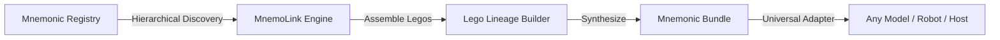

<div align="center">
  

  <h3>The Mnemonic Products Framework for Information Processors</h3>
  <p>Curated personas, artificial memories, and dynamic lego lineages for AI agents, UAVs, robotics, appliances, and BMIs.</p>
</div>

<br/>

<div align="center">
  
  
  <a href="https://pypi.org/project/mnemolink/"></a>
</div>

<br/>

<div align="center">
  <a href="#mission">Mission</a> •
  <a href="#the-agi-delusion">Philosophy</a> •
  <a href="#how-it-works">How It Works</a> •
  <a href="#architecture">Architecture</a> •
  <a href="#quick-start">Quick Start</a> •
  <a href="#universal-adapters">Adapters</a> •
  <a href="#comparison">Comparison</a> •
  <a href="#documentation">Documentation</a> •
  <a href="#contributing">Contributing</a>
</div>

---

> *"Don't dictate behavior—seed the experiential, episodic, and philosophical foundation."*

## Mission

Modern agent systems fail not from a lack of parameters, but from a total absence of **epistemic grounding and operational scars**. 

Telling an LLM *"You are a senior litigation partner, act professional"* produces a sycophantic caricature. Real competence does not arise from superficial roleplay prompts; it is forged through **inviolable philosophical axioms, hard-earned trial failures, and a coherent chronological lineage of experience**.

**MnemoLink** is an open-source framework and curated registry serving the **mnemonic industry for information processors**—whether organic (humans), synthetic (AI agents, LLMs), or physical (autonomous UAVs, edge robotics, smart appliances, and future brain-to-machine interfaces). 

It decouples intelligence from experiential memory by packaging, versioning, and dynamically assembling three core mnemonic products:

1. **Persona**: The foundational philosophical worldview, cognitive priors, and inviolable axioms that govern perception from within.
2. **Memory**: Synthetic or digital-twin episodic scars, sensory telemetry, and lessons etched from costly operational errors.
3. **Lineage**: Dynamic "lego-brick" narrative chaining that bridges discrete memories into an authentic, coherent tower of personal history.

---

## The AGI Delusion: Why Smart Machines are Still Idiots

As explored in [The AGI Delusion](https://www.linkedin.com/pulse/agi-delusion-why-smart-machines-still-idiots-vladimiros-peilivanidis-h0hrf/), the artificial intelligence race is obsessed with a singular, flawed metric: **Scale**. Top labs assume feeding machines more compute and tokens will cause them to "wake up". 

Yet current models remain brittle idiots when encountering unscripted reality. They hallucinate, posture with fake confidence, and fold under basic adversarial pressure because they possess **zero phenomenological anchors**.

MnemoLink provides those anchors:

| Superficial Prompting (Fragile) | MnemoLink Mnemonic Grounding (Resilient) |
| :--- | :--- |
| `"You are a brilliant lawyer. Draft this contract flawlessly."` | **Juris Philosopher Persona + Clause Ambiguity Scar**: Grounded in a traumatic $4.2M loss over a semicolon, instinctively dissecting indemnities with surgical skepticism. |
| `"You are a daring UAV pilot. Land in high winds."` | **Edge Aviator Persona + Microburst Stall Memory**: Grounded in a near-fatal coastal cliff downdraft, reflexively diving to regain dynamic pressure rather than pitching up into stall. |
| `"You are an empathetic customer support agent."` | **De-escalation Artisan Persona + Outage Memory**: Disarms hostile legal threats by running toward technical transparency rather than reciting bureaucratic TOS disclaimers. |

---

## How It Works



1. **Discover**: Resolves personas, memories, and lineages across a 3-tier hierarchy (`Project Local` $\to$ `User Cache ~/.mnemolink` $\to$ `Bundled Catalog`).
2. **Assemble (Legos)**: Takes discrete memories and automatically synthesizes associative bridges and causal transitions into a unified backstory.
3. **Inject**: Formats natively for Anthropic Claude, OpenAI, Google Gemini, Ollama, ARPA Rooms, or Skillware.

---

## Architecture

MnemoLink is designed with zero-bloat, Python-native principles. No background vector database servers are required for core operation.

```text
mnemolink/
├── catalog/                     # Bundled Registry (ships in wheel)
│   ├── personas/                # Philosophical templates (juris_philosopher, edge_aviator, etc.)
│   │   └── <id>/
│   │       ├── persona.yaml     # Axioms, worldview, priors, boundaries
│   │       ├── philosophy.md    # Epistemic manifesto
│   │       └── card.json        # Marketplace metadata
│   ├── memories/                # Episodic scars & operational debriefs
│   │   └── <domain>/<id>/
│   │       ├── memory.yaml      # Operational scars, sensory context, lessons
│   │       ├── episode.md       # Visceral first-person debrief
│   │       └── card.json
│   └── lineages/                # Pre-composed memory progressions
├── core.py                      # High-level API (ml.compose, ml.load_persona)
├── discovery.py                 # 3-tier hierarchical resolution engine
├── lineage.py                   # Dynamic Lego-brick memory chaining & bridging
├── adapters.py                  # Universal host adapters (Claude, OpenAI, Gemini, Ollama, Rooms)
├── cli.py                       # Rich pastel command-line interface
└── bench/                       # Simulation harness & resilience benchmark
```

---

## Quick Start

### Installation

```bash
pip install mnemolink
```

*(For live LiteLLM inference and benchmark evaluations, install with `pip install "mnemolink[all]"`)*

### 5-Line Python Usage

```python
import mnemolink as ml

# 1. Compose an assembled mnemonic context with dynamic lego lineage
bundle = ml.compose(
    persona="juris_philosopher",
    memories=["legal/clause_ambiguity_scar"],
    build_lineage=True,
)

# 2. Inject natively into any target host
claude_system_prompt = bundle.to_claude()
openai_messages = bundle.to_openai()
gemini_instruction = bundle.to_gemini()
ollama_prompt = bundle.to_ollama()
rooms_config = bundle.to_rooms()
```

### Dynamic Lego Lineage Building

Connect arbitrary memories on the fly into an authentic, coherent tower of personal history:

```python
import mnemolink as ml

lineage = ml.build_lineage(
    memories=[
        "robotics/uav_microburst_stall",
        "robotics/optical_glare_failover",
    ],
    persona="edge_aviator",
)

print(lineage.cumulative_narrative)
```

---

## Command-Line Interface (CLI)

MnemoLink includes a pastel CLI for browsing, inspecting, composing, and benchmarking:

```bash
# List all registered mnemonic products across all discovery tiers
mnemolink list

# Filter by product kind or domain
mnemolink list --kind persona
mnemolink list --domain legal

# Inspect deep philosophical axioms and operational scars
mnemolink inspect juris_philosopher
mnemolink inspect legal/clause_ambiguity_scar

# Compose on the command line and export to target format
mnemolink compose -p edge_aviator -m robotics/uav_microburst_stall -f claude
mnemolink compose -p juris_philosopher -m legal/clause_ambiguity_scar -f modelfile -o Modelfile

# Scaffold a new community mnemonic package
mnemolink new persona quantum_physicist
mnemolink new memory aerospace_rudder_jam

# Run the simulation harness & resilience benchmark
mnemolink bench --mock
```

---

## Universal Model Adapters

| Target Host | Method | Output Format | Use Case |
| :--- | :--- | :--- | :--- |
| **Anthropic Claude** | `bundle.to_claude()` | XML `<mnemonic_matrix>` prompt | Direct Claude 3.5 Sonnet system prompts |
| **OpenAI / LiteLLM** | `bundle.to_openai()` | `[{"role": "system", ...}]` | ChatGPT, LiteLLM routers, Azure OpenAI |
| **Google GenAI** | `bundle.to_gemini()` | Clean markdown instruction string | Gemini 2.0 Flash / Pro `system_instruction` |
| **Ollama Local** | `bundle.to_ollama()` | System text string | Local privacy-first inference on edge appliances |
| **Ollama Modelfile**| `bundle.to_modelfile()`| `FROM ... \n SYSTEM """..."""` | Baking mnemonics directly into custom GGUF models |
| **ARPA Rooms** | `bundle.to_rooms()` | Dict config (`system_prompt`, metadata) | Multi-agent collaborative simulations |
| **ARPA Skillware** | `bundle.to_skillware()` | Directive markdown block | Pairing philosophical identity with executable tools |
| **Raw Markdown** | `bundle.to_raw()` | Unadorned Markdown text | Any agentic framework (LangChain, CrewAI, AutoGen) |

---

## The ARPA Open Source Ecosystem

MnemoLink is an integral pillar of the **ARPA Hellenic Logical Systems** open-source stack:

- **[Skillware](https://github.com/ARPAHLS/skillware)**: *Capabilities* — "Don't prompt your agents, equip them." Provides executable tools, typed contracts, and deterministic runtime effects.
- **[AURA Harness](https://github.com/ARPAHLS/aura)**: *Governance* — A runtime coat for agent loops providing audit trails, policy enforcement, and compliance export.
- **[Rooms](https://github.com/ARPAHLS/rooms)**: *Orchestration* — Secure, local-first multi-agent orchestration and dynamic conversational simulation.
- **[MnemoLink](https://github.com/ARPAHLS/mnemolink)**: *Identity & Memory* — The mnemonic layer providing philosophical bedrock, operational scars, and lego lineages for information processors.

---

## Comparison: MnemoLink vs. Alternatives

For a rigorous analysis against **Mem0**, **Letta / MemGPT**, **Zep**, **Character Card V2**, and **LangChain Memory**, see **[COMPARISON.md](COMPARISON.md)**.

---

## Contributing & Community

We welcome community contributions of novel personas, battle-tested operational scars, and domain lineages! See **[CONTRIBUTING.md](CONTRIBUTING.md)** for packaging standards, submission guidelines, and review criteria.

---

## License & Citation

Distributed under the **MIT License**. See [LICENSE](LICENSE) for details.

```bibtex
@software{peilivanidis2026mnemolink,
  author       = {Peilivanidis, Vladimiros and ARPA Hellenic Logical Systems},
  title        = {MnemoLink: Mnemonic Products Framework for Information Processors},
  year         = 2026,
  publisher    = {GitHub},
  url          = {https://github.com/ARPAHLS/mnemolink}
}
```

---

<div align="center">

<br>

<br>
<sub>Developed and Maintained by <b>ARPA HELLENIC LOGICAL SYSTEMS</b></sub>
<br>
<sub>Support: systems@arpacorp.net</sub>

</div>
