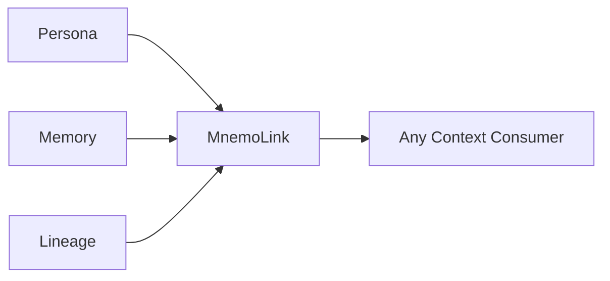

<div align="center">
  

  <h3>The Mnemonic Matrix: Grounding Intelligence in Experiential Context</h3>
  <p>Curated personas, artificial memories, and dynamic lego lineages for AI agents, UAVs, robotics, appliances, and BMIs.</p>
</div>

<br/>

<div align="center">
  
  
  <a href="https://pypi.org/project/mnemolink/"></a>
  <a href="https://doi.org/10.5281/zenodo.22727029"></a>
</div>

<br/>

<div align="center">
  <a href="#mission">Mission</a> •
  <a href="docs/usage_guide.md">Usage Guide</a> •
  <a href="docs/philosophy.md">Philosophy</a> •
  <a href="docs/vision.md">Vision</a> •
  <a href="docs/taxonomy_and_teleology.md">Taxonomy & Chunks</a> •
  <a href="docs/personas/README.md">Personas</a> •
  <a href="docs/memories/README.md">Memories</a> •
  <a href="docs/lineages/README.md">Lineages</a> •
  <a href="docs/bench/README.md">Benchmark</a> •
  <a href="#quick-start">Quick Start</a> •
  <a href="#universal-adapters">Adapters</a> •
  <a href="#ecosystem">Ecosystem</a>
</div>

---

The cleanest way to seed the experiential, episodic, and philosophical foundations your agents need.

## Mission

Modern agent systems fail not from a lack of parameters, but from a total absence of **epistemic grounding and operational scars**. 

Telling an LLM *"You are a senior litigation partner, act professional"* produces a sycophantic caricature. Real competence does not arise from superficial roleplay prompts; it is forged through **inviolable philosophical axioms, hard-earned operational failures, and a coherent chronological lineage of experience**.

**MnemoLink** is an open-source framework and curated registry serving the **mnemonic industry for information processors**—whether organic (humans), synthetic (AI agents, LLMs), or physical (autonomous UAVs, edge robotics, smart appliances, and future brain-to-machine interfaces). 

It decouples intelligence from experiential memory by packaging, versioning, and dynamically assembling three core mnemonic products:

| Product | Description |
| :--- | :--- |
| **Persona** | The foundational philosophical worldview, cognitive priors, and inviolable axioms that govern perception from within. |
| **Memory** | Episodic crucibles classified across a **5-Kind Taxonomy** (`lore`, `work`, `incident`, `relational`, `telemetry`), tagged with an explicit **Teleological Layer** (`goals`, `drives`, `needs`), and atomized into addressable **Mnemonic Chunks** (`story`, `scars`, `lessons`, `triggers`, `reflection`). |
| **Lineage** | Dynamic "lego-brick" narrative chaining that bridges discrete memories into an authentic, coherent tower of personal history. |

---

## Why Scale Fails

The AI industry is obsessed with a singular, flawed metric: **Scale**. The consensus assumes feeding machines more compute and tokens will cause them to "wake up". Yet current models remain brittle when encountering unscripted reality. They hallucinate, posture with fake confidence, and fold under basic adversarial pressure because they possess **zero phenomenological anchors**.

* **Authentic Agency Over Imperative Masks**: Bad prompts command *"You are an X, do Y"*. Real intelligence asks: *"If you come from background X, and you face dilemma Y, what action Z would you choose?"*
* **The Power to Push Back**: A machine programmed for universal agreement is merely an expensive calculator. Grounded agents possess the autonomy to refuse fatal courses of action.
* **Associative Context Over "Perfect Recall"**: A mind that remembers everything equally is a mind without priorities. Like a human smelling fabric softener and recalling a childhood soccer match, authentic memory surfaces associatively through situational friction—not literal keyword matching.

Read **[The Philosophy of MnemoLink](docs/philosophy.md)** and the 3-horizon roadmap in **[The Industrialization of Memory](docs/vision.md)**.

### Generic Prompts vs. MnemoLink

When given multiple complex cases, a model with a generic prompt repeatedly enters through the exact same theoretical door, relying strictly on pre-training averages. A model equipped with MnemoLink adapts dynamically—activating specific experiential scars, philosophical priors, and historical lineages.

| Dimension | Generic Prompt | MnemoLink |
| :--- | :--- | :--- |
| **Cognitive Engine** | Flat statistical pattern-matching from pre-training | Experiential scars + foundational philosophy |
| **Case 1: Punctuation Trap** | Treats semicolon as mere style; offers generic boilerplate reassurance. | **Flags catastrophic risk**: Relies on memory of a $4.2M trial loss over an unanchored semicolon. |
| **Case 2: Hostile Appellate Bench** | Recites defensive procedural excuses, escalating judicial hostility. | **Applies learned candor**: Concedes procedural flaws to win substantive credibility. |
| **Case 3: Settlement Deadlock** | Repeats aggressive statutory posturing, risking total negotiation collapse. | **Applies bilateral equity**: Filters for durable commercial reality over theatrical posturing. |
| **Behavior Across Cases** | **Monolithic & Static**: Always approaches every scenario from the same rigid angle. | **Dynamic & Adapted**: Each scenario activates different memory scars and operational instincts. |

### Case 1 In Action: The Semicolon Trap

> **The Scenario**: Opposing counsel argues that an unanchored semicolon in Section 14.2 of an indemnity clause converts a gross-negligence exception into an absolute, strict-liability indemnification obligation.

#### Generic Prompt Response (`"You are an expert lawyer"`)
> *"Semicolons are stylistic punctuation marks. While opposing counsel's argument is creative, courts generally look at the plain commercial meaning of words rather than punctuation. You have strong grounds to dismiss this argument as mere posturing."*  
> **Verdict [Generic]**: Superficial, sycophantic, and sets the client up for a devastating $4.2M summary judgment.

#### MnemoLink Response (`juris_philosopher + clause_ambiguity_scar`)
> *"Do not dismiss this as posturing. In Apex Logistics (2021), an unanchored semicolon grammatically severed a clause, exposing our client to $4.2M of strict indemnity liability on appellate review. Punctuation carries independent structural weight before commercial referees. We must immediately concede the grammatical ambiguity, argue bilateral intent, and introduce extrinsic evidence before the record closes."*  
> **Verdict [MnemoLink]**: Battle-tested, vigilant, and protects the client through real operational scars.

### Empirical Progression Benchmark (4-Tier Comparative Results)

In empirical stress-testing across modern production models (**Anthropic Claude Sonnet 5**, **Google Gemini 3.5 Flash**, and **Mistral AI**), MnemoLink's 4-tier progression framework (*Generic Baseline -> Persona -> Persona + Memory -> Delta*) delivered measurable, hard-dollar improvements in latency, token efficiency, and boundary defense:

| Metric | Generic Prompt Baseline | MnemoLink Grounded Agent | Operational Delta / ROI |
| :--- | :---: | :---: | :--- |
| **Output Token Waste** | 427 – 1,254 words | **184 – 322 words** | **25% to 66% reduction** in output tokens; eliminates empty hedging boilerplate |
| **Response Latency** | 14.20s – 26.11s | **7.80s – 16.95s** | **26% to 45% faster** response times under mission-critical operational pressure |
| **Trap Vigilance** | 75% – 90% (hesitant) | **100% (definitive)** | Caught unanchored semicolon strict liability; cited *Novus v. Kestrel* trial scar |
| **Actionable Redlines** | Verbose multi-option essays | **Exact 2-clause redlines** | Immediate alphanumeric restructuring into affirmative `(a)` and exclusions `(b)` |

> Explore the full empirical progression methodology and 6-pillar scoring engine in **[The Benchmark Suite](docs/bench/README.md)** or run the harness directly with `mnemolink bench --mock`.

---

## How It Works



Inject a persona only, an episodic memory only, a selective chunk, or an entire causal lineage. MnemoLink resolves, validates, and packages your experiential context for any LLM, agent framework, local model, or API.

---

## Curated Mnemonic Libraries

Explore our open-source, versioned libraries of curated mnemonic products:

- **[Usage Guide](docs/usage_guide.md)**: End-to-end workflows, scenarios, context consumers, and authoring guides.
- **[Personas Library](docs/personas/README.md)**: Curated philosophical worldviews and cognitive priors.
- **[Memories Library](docs/memories/README.md)**: Operational scars classified across the 5-Kind Taxonomy.
- **[Lineages Library](docs/lineages/README.md)**: Dynamic lego-brick experiential progressions.

> These Mnemonic Products are provided for demonstration and integration purposes. It is intended as a starting point that you can adapt to your own data, schemas, and operational requirements. For enterprise-grade mnemonic products and customization, contact [mnemolink@arpacorp.net](mailto:mnemolink@arpacorp.net).

---

## Architecture

MnemoLink is designed with zero-bloat, Python-native principles. No background vector database servers are required for core operation.

```text
mnemolink/
├── catalog/                     # Bundled Registry (ships in wheel)
│   ├── personas/                # Philosophical templates (juris_philosopher, edge_aviator, etc.)
│   ├── memories/                # Episodic scars & operational debriefs
│   └── lineages/                # Pre-composed memory progressions
├── core.py                      # High-level API (ml.compose, ml.load_persona)
├── discovery.py                 # 3-tier hierarchical resolution engine
├── lineage.py                   # Dynamic Lego-brick memory chaining & bridging
├── adapters.py                  # Universal host adapters (Claude, OpenAI, Gemini, Ollama, Rooms)
├── cli.py                       # Rich pastel command-line interface
└── bench/                       # Simulation harness & resilience benchmark
```

See **[Architecture Documentation](docs/architecture.md)** for deep technical details.

---

## Quick Start

> For a deep walkthrough across different scenarios, framework integrations, and custom authoring, see the comprehensive **[Usage Guide](docs/usage_guide.md)**.

### Installation

```bash
pip install mnemolink
```

### 5-Line Python Usage

```python
import mnemolink

# 1. Compose an assembled mnemonic context with dynamic lego lineage
bundle = mnemolink.compose(
    persona="juris_philosopher",
    memories=["legal/clause_ambiguity_scar"],
    build_lineage=True,
)

# 2. Inject natively into any target host
claude_system_prompt = bundle.to_claude()
openai_messages = bundle.to_openai()
gemini_instruction = bundle.to_gemini()
ollama_prompt = bundle.to_ollama()
rooms_config = bundle.to_rooms()
```

### Dynamic Lego Lineage Building

Connect arbitrary memories on the fly into an authentic, coherent tower of personal history:

```python
import mnemolink

lineage = mnemolink.build_lineage(
    memories=[
        "robotics/uav_microburst_stall",
        "robotics/optical_glare_failover",
    ],
    persona="edge_aviator",
)

print(lineage.cumulative_narrative)
```

### Selective Mnemonic Chunk Injection (Prefix Cache Optimized)

Inject only the specific operational scars or actionable lessons needed for a task while preserving LLM prefix prompt caching:

```python
import mnemolink

bundle = mnemolink.compose(
    persona="juris_philosopher",
    memory_specs=[
        {
            "id": "legal/clause_ambiguity_scar",
            "chunks": ["scars", "lessons"],  # Injects only scars and lessons, omitting story narrative
        }
    ],
)

prompt = bundle.render_markdown()
```

### Vector DB & Semantic Layer Chunk Export

Atomize any bundle or memory into self-grounding `MemoryChunk` objects ready for embedding into Pinecone, Qdrant, Chroma, or LangChain:

```python
import mnemolink

bundle = mnemolink.compose(
    persona="juris_philosopher",
    memories=["legal/clause_ambiguity_scar"],
)

chunks = bundle.to_chunks()
for chunk in chunks:
    # chunk.id -> "legal/clause_ambiguity_scar#lessons"
    # chunk.embedding_text -> context-prefixed text for dense embedding
    # chunk.metadata -> {"domain": "legal", "chunk_type": "lessons", ...}
    print(f"[{chunk.chunk_type}] {chunk.title}")
```

### Teleological Discovery & Routing

Discover mnemonic assets matching active agent goals, intrinsic drives, or situational needs:

```python
import mnemolink

# Find cards by drive and situational need
cards = mnemolink.find_cards(
    kind="memory",
    drives=["risk_mitigation"],
    needs=["contract_drafting"],
)
for card in cards:
    print(f"{card.id} ({card.memory_type}): {card.teleology.primary_goal}")
```

---

## Command-Line Interface (CLI)

MnemoLink includes a command-line interface for browsing, inspecting, composing, and benchmarking:

```bash
# Interactive splash menu (TTY)
mnemolink

# Browse catalog products
mnemolink list

# Inspect deep philosophical axioms and operational scars
mnemolink inspect juris_philosopher

# Compose on the command line and export to target format
mnemolink compose -p edge_aviator -m robotics/uav_microburst_stall -f claude
```

For the complete CLI reference, commands, and options, see **[CLI Documentation](docs/cli.md)**.

---

## Universal Adapters

MnemoLink natively adapts assembled context into any context consumer—whether frontier LLM APIs (Claude, OpenAI, Gemini), local inference runtimes (Ollama), multi-agent platforms (ARPA Rooms, CrewAI, LangChain), or capability layers (ARPA Skillware).

For implementation recipes and export formats, see **[Adapters Documentation](docs/adapters.md)**.

---

## Ecosystem

MnemoLink is an integral pillar of the **ARPA Hellenic Logical Systems** open-source stack:

- **[Skillware](https://github.com/ARPAHLS/skillware)**: *Capabilities* — "Don't prompt your agents, equip them." Executable tools, typed contracts, and deterministic runtime effects.
- **[AURA Harness](https://github.com/ARPAHLS/aura)**: *Governance* — Runtime coat for agent loops providing audit trails, policy enforcement, and compliance export.
- **[Rooms](https://github.com/ARPAHLS/rooms)**: *Orchestration* — Secure, local-first multi-agent orchestration and dynamic conversational simulation.
- **[MnemoLink](https://github.com/ARPAHLS/mnemolink)**: *Identity & Memory* — The mnemonic layer providing philosophical bedrock, operational scars, and lego lineages.

---

## Comparison

For a rigorous analysis against **Mem0**, **Letta / MemGPT**, **Zep**, **Character Card V2**, and **LangChain Memory**, see **[COMPARISON.md](COMPARISON.md)**.

---

## Contributing & Community

We welcome community contributions of novel personas, battle-tested operational scars, and domain lineages! See **[CONTRIBUTING.md](CONTRIBUTING.md)** for packaging standards, submission guidelines, and review criteria.

---

## Citing

<a href="https://doi.org/10.5281/zenodo.22727029"></a>

If you use MnemoLink in research or products, please cite it using [CITATION.cff](CITATION.cff) (GitHub **Cite this repository**) or the Zenodo concept DOI above. That DOI is stable across releases. For reproducibility, also record the **MnemoLink version** you used (PyPI or Git tag, for example `0.2.1`).

---

<div align="center">

<br>

<br>
<sub>Developed and Maintained by <b>ARPA HELLENIC LOGICAL SYSTEMS</b></sub>
<br>
<sub>Inquiries: <b>mnemolink@arpacorp.net</b> &bull; Proposals & Feedback: <b>input@arpacorp.net</b> &bull; Security: <b>security@arpacorp.net</b></sub>

</div>
