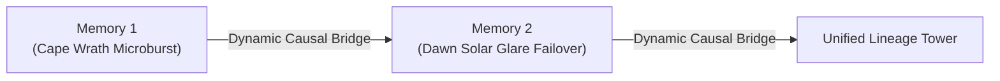

# MnemoLink Architecture

## Core Architectural Pillars

MnemoLink is built on five foundational architectural pillars:
1. **Hierarchical 3-Tier Resolution Engine** (`MnemonicResolver`)
2. **Dynamic Lego Lineage Builder** (`LineageBuilder`)
3. **Standardized Mnemobit Chunking & Semantic Bridge** (`MemoryChunk`, `to_chunks`)
4. **Teleological Routing & Manifest Layer** (`Teleology`, `find_cards`)
5. **Universal Model & Host Adapters with Prefix Caching Optimization** (`MnemonicBundle`)

---

## 1. Hierarchical Resolution Hierarchy

MnemoLink implements the same clean path-resolution pattern established by sister repository [Skillware](https://github.com/ARPAHLS/skillware):

```
Precedence:
  1. Project Local    -> ./.mnemolink, ./mnemonics, ./catalog
  2. User Store       -> ~/.mnemolink, $MNEMOLINK_PATH
  3. Bundled Catalog  -> mnemolink/catalog (shipped in wheel)
```

When an application calls `mnemolink.compose(persona="juris_philosopher")`:
- The engine checks project-local directories first, allowing teams to override or customize bundled archetypes without modifying the installed library.
- It then falls back to user-global or environment paths (`$MNEMOLINK_PATH`).
- Finally, it falls back to the official built-in catalog.

---

## 2. Dynamic Lego Lineage Synthesizer

Rather than forcing users to manually script long autobiographical texts, MnemoLink treats memories like lego bricks:



The `LineageBuilder` takes any arbitrary list of `MemoryProduct`s and:
- Organizes them chronologically into evolutionary epochs.
- Analyzes domain transitions and lesson outcomes.
- Automatically generates connective causal bridges (e.g. *"The scar left by Memory 1 fundamentally reshaped operating assumptions; when Memory 2 occurred, the agent approached it with vigilant skepticism rather than naive trust"*).
- Compiles cumulative experiential reflexes that organically shape downstream choices.

---

## 3. Standardized Mnemobit Chunking & Semantic Bridge

MnemoLink does not seek to replace vector databases, graph stores, or agentic frameworks (such as LangChain, LlamaIndex, or AutoGen). Instead, it provides the standardized, high-salience context layer that feeds them.

Every `MemoryProduct` can be atomized into five standard **Mnemobit Chunks**:
- `story`: The episodic chronology and narrative setting.
- `scars`: Visceral financial, physical, or operational damage incurred.
- `lessons`: Imperative operational axioms learned from the crucible.
- `triggers`: Sensory cues and warning signs signaling scenario repetition.
- `reflection`: Deeper philosophical and epistemological meaning.

Personas are similarly chunked into `identity`, `axioms`, `boundaries`, and `philosophy`.

```python
# Atomize any bundle or memory into self-grounding chunks for vector database ingestion
chunks = bundle.to_chunks()
for chunk in chunks:
    # chunk.id, chunk.embedding_text, chunk.salience, chunk.metadata
    vector_db.upsert(id=chunk.id, vector=embed(chunk.embedding_text), metadata=chunk.metadata)
```

---

## 4. Teleological Routing & Manifest Layer

Every catalog asset includes a `card.json` manifest enriched with teleological metadata:
- `primary_goal`: The strategic objective the asset was forged to serve.
- `agent_drives`: Intrinsic behavioral motivations (e.g., `risk_mitigation`, `fiduciary_preservation`).
- `applicable_needs`: Specific operational contexts (e.g., `contract_drafting`, `stall_recovery`).

Hosts can filter and discover mnemonic assets algorithmically without vector searches:

```python
cards = mnemolink.find_cards(kind="memory", drives=["risk_mitigation"], needs=["contract_drafting"])
```

---

## 5. Universal Model Adapters & Prefix Prompt Caching

Once a `MnemonicBundle` is compiled, it can be emitted in the native format required by any runtime or provider:

- **Anthropic Claude**: Wraps grounding in `<mnemonic_matrix>` XML structure for optimal attention adherence.
- **OpenAI / LiteLLM**: Emits clean `[{"role": "system", "content": ...}]` schemas.
- **Google GenAI / Gemini**: Formats for `system_instruction`.
- **Ollama**: Generates system text strings or complete `Modelfile` assets.
- **ARPA Rooms**: Exports agent dictionaries with embedded system instructions and metadata.
- **ARPA Skillware**: Exports `instructions.md` directive blocks for tool-equipped agents.
- **Raw**: Pure Markdown text suitable for any agentic framework.

### Prefix Cache Optimization
Modern LLMs cache identical prompt prefixes to drastically cut latency and cost. MnemoLink structures prompt outputs in a strict hierarchy:
1. **Static Invariant Anchor**: The immutable Persona instructions, axioms, and boundaries sit at the top of the prompt.
2. **Dynamic Context Tail**: Granular, selectively requested memory chunks sit at the end of the prompt.

This ensures modifications to selected memories do not invalidate the KV cache of the foundational persona.

---

## Curated Catalog Libraries

Browse the official open-source registries for bundled mnemonic assets:
- **[Personas Library](personas/README.md)**: Philosophical foundations (`juris_philosopher`, `edge_aviator`, `deescalation_artisan`, `opsie_sci`).
- **[Memories Library](memories/README.md)**: Operational scars classified across the 5-Kind Taxonomy.
- **[Lineages Library](lineages/README.md)**: Dynamic lego-brick chained progressions (`legal_crucible`, `flight_scars`).
- **[Benchmark & Simulation Suite](bench/README.md)**: Empirical stress-test results across Claude and Gemini evaluating latency, token waste, and risk mitigation.
