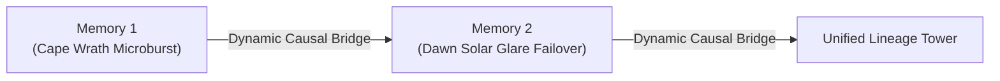

# MnemoLink Architecture

## Core Architectural Pillars

MnemoLink is built on three foundational architectural pillars:
1. **Hierarchical 3-Tier Resolution Engine** (`MnemonicResolver`)
2. **Dynamic Lego Lineage Builder** (`LineageBuilder`)
3. **Universal Model & Host Adapters** (`MnemonicBundle`)

---

## 1. Hierarchical Resolution Hierarchy

MnemoLink implements the same clean path-resolution pattern established by sister repository [Skillware](https://github.com/ARPAHLS/skillware):

```
Precedence:
  1. Project Local    -> ./.mnemolink, ./mnemonics, ./catalog
  2. User Store       -> ~/.mnemolink, $MNEMOLINK_PATH
  3. Bundled Catalog  -> mnemolink/catalog (shipped in wheel)
```

When an application calls `ml.compose(persona="juris_philosopher")`:
- The engine checks project-local directories first, allowing teams to override or customize bundled archetypes without modifying the installed library.
- It then falls back to user-global or environment paths (`$MNEMOLINK_PATH`).
- Finally, it falls back to the official built-in catalog.

---

## 2. Dynamic Lego Lineage Synthesizer

Rather than forcing users to manually script long autobiographical texts, MnemoLink treats memories like lego bricks:



The `LineageBuilder` takes any arbitrary list of `MemoryProduct`s and:
- Organizes them chronologically into evolutionary epochs.
- Analyzes domain transitions and lesson outcomes.
- Automatically generates connective causal bridges (e.g. *"The scar left by Memory 1 fundamentally reshaped operating assumptions; when Memory 2 occurred, the agent approached it with vigilant skepticism rather than naive trust"*).
- Compiles cumulative experiential reflexes that organically shape downstream choices.

---

## 3. Universal Model Injection Adapters

Once a `MnemonicBundle` is compiled, it can be emitted in the native format required by any runtime or provider:

- **Anthropic Claude**: Wraps grounding in `<mnemonic_matrix>` XML structure for optimal attention adherence.
- **OpenAI / LiteLLM**: Emits clean `[{"role": "system", "content": ...}]` schemas.
- **Google GenAI / Gemini**: Formats for `system_instruction`.
- **Ollama**: Generates system text strings or complete `Modelfile` assets.
- **ARPA Rooms**: Exports agent dictionaries with embedded system instructions and metadata.
- **ARPA Skillware**: Exports `instructions.md` directive blocks for tool-equipped agents.
- **Raw**: Pure Markdown text suitable for any agentic framework.
