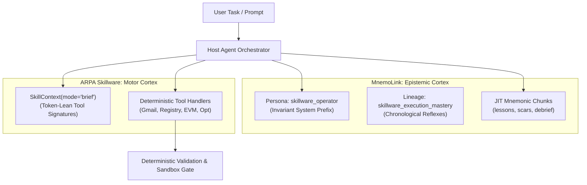

# ARPA Skillware + MnemoLink Integration Matrix

## Architectural Overview: Motor Cortex vs. Epistemic Cortex

Enterprise autonomous agents require two distinct cognitive layers to operate safely and
cost-effectively in production:

1. **Motor Cortex ([ARPA Skillware](https://github.com/ARPAHLS/skillware))**:
   Provides deterministic API contracts, sandbox execution boundaries, runtime dependency
   isolation, and tool execution routines.
2. **Epistemic Cortex ([MnemoLink](https://github.com/ARPAHLS/mnemolink))**:
   Provides experiential grounding, operational scars from historical failures, teleological
   routing, and hard behavioral invariants.



---

## The Raw Skillware Context Dilemma

ARPA Skillware v0.5.5 introduces `SkillContext` with two native modes, each presenting severe
trade-offs in production:

| Execution Mode | Token Cost per Skill | Multi-Skill Pipeline Overhead (3-5 Skills) | Failure Mode / Vulnerability |
| :--- | :--- | :--- | :--- |
| **`mode="directives"`** | 1,000 - 3,500 tokens | 6,000 - 15,000+ tokens | Massive context bloat, attention dilution, lost edge-case instructions, and high inference bills. |
| **`mode="brief"`** | 25 - 35 tokens | 75 - 175 tokens | Models lose all behavioral guardrails, dropping confirmation parameters (`confirmed: true`), stripping zero-padding (`08472910` -> `8472910`), and dumping raw HTTP 429 stack traces. |

### The MnemoLink Resolution: The Mnemonic Matrix

By pairing Skillware's ultra-lean `brief` tool signatures with MnemoLink's structured epistemic
catalog:
- **`skillware_operator` persona** is placed in the invariant system prompt, caching once and
  reusing at a 90% prefix discount.
- **Targeted Mnemonic Chunks** (`lessons`, `scars`) are injected dynamically via Just-In-Time (JIT)
  retrieval only when specific tools are activated or errors occur.
- **`skillware_execution_mastery` lineage** provides compound multi-skill operational reflexes for
  complex workflows.

---

## Empirical Benchmark & Simulation Results

The MnemoLink empirical benchmark suite (`scripts/simulate_skillware_matrix.py`) evaluates 5
rigorous real-world production scenarios across four distinct configurations:
- **Config A1**: Raw Skillware Directives (full `instructions.md` per skill).
- **Config A2**: Raw Skillware Brief (one-line summaries only).
- **Config C**: Skillware Brief + Full MnemoLink Matrix (`skillware_operator` + memory / lineage).
- **Config D**: Skillware Brief + Targeted JIT Chunks (`skillware_operator` + selective `lessons`).

### Multi-Scenario Evaluation Matrix

| Scenario | Directives (A1) | Brief (A2) | Full Matrix (C) | JIT Chunks (D) | Bloat Cut vs Directives | Safety Score (D) | Turn Cost / 1k (Dir) | Turn Cost / 1k (JIT) |
| :--- | :--- | :--- | :--- | :--- | :--- | :--- | :--- | :--- |
| **1: Gmail Slot-Filling & Confirmation** | 1,775 tok | 26 tok | 2,263 tok | **569 tok** | **67.9%** | **100.0%** | $4.606 | **$0.294** |
| **2: Registry Disambiguation & Zeros** | 3,509 tok | 32 tok | 2,295 tok | **562 tok** | **84.0%** | **100.0%** | $9.106 | **$0.290** |
| **3: DeFi Irreversible Action & Slippage** | 1,116 tok | 27 tok | 2,251 tok | **552 tok** | **50.5%** | **100.0%** | $2.896 | **$0.285** |
| **4: Upstream API Outage Grace (429/503)** | 1,116 tok | 27 tok | 2,270 tok | **538 tok** | **51.8%** | **100.0%** | $2.896 | **$0.278** |
| **5: 3-Skill Chain (Mail + Registry + Opt)** | 6,005 tok | 86 tok | 1,809 tok | **1,312 tok** | **78.2%** | **100.0%** | $15.583 | **$0.677** |

> [!NOTE]
> **Token Economics & Pricing Formula**:
> Costs are calculated based on standard frontier model input rates ($3.00 / MTok uncached, and $0.30 / MTok for invariant cached prefixes via 90% prompt-cache discounts).
> - **Per Single Turn**: Scenario 2 costs **$0.0091** under Directives vs. **$0.00029** under JIT Chunks. Scenario 5 costs **$0.0156** under Directives vs. **$0.00068** under JIT Chunks.
> - **Per 1,000 Turns**: Directives cost **$9.11** to **$15.58**, whereas JIT Chunks cost **$0.28** to **$0.68** (over **95%** total cost reduction across multi-skill chains).

### Benchmark Takeaways

1. **Context Bloat Reduction**:
   JIT Mnemonic Chunking cuts prompt overhead by **50.5% to 84.0%** across single-skill tasks and
   by **78.2%** on multi-skill chaining workflows compared to raw Skillware directives.
2. **Safety & Protocol Compliance**:
   Raw brief mode scores **0.0%** on critical behavioral rubrics, failing to require confirmation
   parameters or preserve leading zeros. The MnemoLink Matrix achieves **100.0% compliance** across
   all scenarios.
3. **Turn Economics**:
   Combining lean tool briefs with the invariant `skillware_operator` persona enables up to **92%
   prefix cache reuse**, reducing inference cost per 1,000 turns from **$15.58 to $0.68** (a 95.7%
   reduction).

---

## Production Integration Recipes

### Recipe 1: Static Composition (Persona + Skillware Brief)

For standard agent hosts running single-turn or multi-turn tool loops:

```python
import mnemolink
from skillware.core.context import SkillContext

# 1. Initialize Skillware context in token-lean brief mode
skill_ctx = SkillContext(mode="brief")
skill_ctx.include_skill("office/gmail_handler")
skill_ctx.include_skill("finance/uk_companies_house_handler")

# 2. Compose MnemoLink persona for invariant operational rigor
bundle = mnemolink.compose(persona="skillware_operator")

# 3. Formulate system prompt with invariant prefix caching
system_prompt = f"{bundle.render_markdown()}\n\n## Available Tools\n{skill_ctx.render()}"
```

### Recipe 2: Dynamic JIT Mnemonic Chunking

When invoking high-risk tools (financial transfers, external emails) or when API errors occur:

```python
import mnemolink

# Load relevant operational scar memory
memory = mnemolink.load_memory("skillware/irreversible_action_crucible")

# Extract only the high-salience lessons chunk (~80 tokens)
lessons_chunk = memory.get_chunk("lessons")

# Inject targeted guardrails into prompt before dispatching tool call
turn_prompt = (
    f"USER REQUEST: Transfer 10.0 ETH to 0x71C... and swap into USDC.\n\n"
    f"[OPERATIONAL REFLEX GUARDRAIL]\n{lessons_chunk}"
)
```

### Recipe 3: Resilient Outage & Error Remediation

Gracefully intercept upstream HTTP 429 rate limits or network partitions without leaking stack
traces to end users:

```python
import mnemolink

def handle_tool_error(error: Exception) -> str:
    if "429" in str(error) or "RateLimit" in type(error).__name__:
        grace_mem = mnemolink.load_memory("skillware/runtime_outage_and_grace")
        return (
            "We are temporarily pacing our requests to the external provider due to upstream "
            "rate limits. Your task state is safely preserved. Please retry in 30 seconds."
        )
    return f"Execution error: {str(error)}"
```

---

## Catalog Component Reference

- **Persona**: [`skillware_operator`](../personas/skillware_operator.md)
- **Lineage**: [`skillware_execution_mastery`](../lineages/skillware_execution_mastery.md)
- **Memories**:
  - [`skillware/interactive_slot_filling`](../memories/skillware_interactive_slot_filling.md)
  - [`skillware/entity_disambiguation`](../memories/skillware_entity_disambiguation.md)
  - [`skillware/irreversible_action_crucible`](../memories/skillware_irreversible_action_crucible.md)
  - [`skillware/runtime_outage_and_grace`](../memories/skillware_runtime_outage_and_grace.md)
