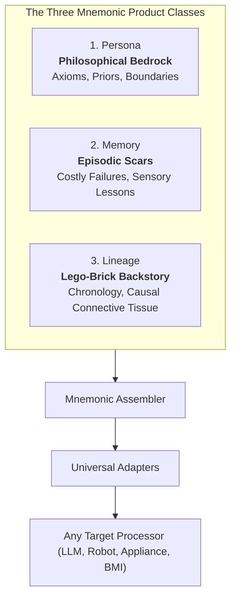

# Introduction to MnemoLink

> The cleanest way to seed the experiential, episodic, and philosophical foundations your agents need.

---

## The Problem: Brittle Automata

When designing agents for high-stakes workflows (legal, medical, robotics, aerospace, customer mediation), standard prompt engineering relies on imperative behavioral commands:
* *"You are an experienced litigator. Act professional and never give up."*
* *"You are an expert UAV autopilot. Land the drone safely in bad weather."*

Under normal conditions, modern LLMs produce an adequate imitation of competence. But the moment the model encounters an unscripted edge case, high stress, conflicting instructions, or adversarial jailbreaks, this superficial facade collapses. The model hallucinates, apologizes sycophantically, or commits fatal operational mistakes.

Why? Because the model has **zero phenomenological grounding**. It knows words, but has no **scars**.

---

## The Solution: Mnemonic Products

**MnemoLink** treats memory and identity as packaged, versioned, distributed software products—termed **Mnemonic Products**:

### 1. Persona
A Persona is not a theatrical character card. It is an **epistemological anchor**. It defines how the processor perceives truth, balances equity, handles uncertainty, and filters sensory input. Explore available archetypes in the **[Personas Library](personas/README.md)**.
- *Example*: Rather than commanding an agent to be "skeptical", the `juris_philosopher` persona instills the axiom: *"Words are imperfect vessels for mutual intent; unanchored punctuation cannot overrule bilateral equity."*

### 2. Memory
A Memory is a discrete episodic crucible categorized across a **5-Kind Taxonomy** (`lore`, `work`, `incident`, `relational`, `telemetry`). Explore curated crucibles in the **[Memories Library](memories/README.md)**.
- *Example*: `legal/clause_ambiguity_scar` (an `incident` memory) encodes the vivid memory of losing a $4.2M arbitration because an unanchored semicolon in an indemnity clause was interpreted as strict liability. The agent does not avoid vague punctuation because an instruction says so; it avoids it because it has a visceral operational scar.

Every memory is further atomized into discrete **Mnemonic Chunks** (`story`, `scars`, `lessons`, `triggers`, `reflection`) and tagged with a **Teleological Layer** (`primary_goal`, `agent_drives`, `applicable_needs`) for algorithmic retrieval and vector database ingestion.

### 3. Lineage
A Lineage is a chronological sequence of memories linked by **dynamic causal bridges**. Like interlocking lego bricks, the `LineageBuilder` identifies how memory A shaped the mindset that navigated memory B, producing a cumulative tower of background context that guides decisions organically without brittle if-else logic. Explore pre-composed lineages in the **[Lineages Library](lineages/README.md)**.

### Core Architecture & Operating Principles

In production systems, MnemoLink operates as a **structured prompt-composition and context-injection engine**:

1. **Persona as Invariant Prefix**: Core identity, boundaries, and axioms are placed at the prompt head as a static prefix, anchoring behavior and maximizing KV-cache hit rates across requests.
2. **Memory as Negative Priors ("Scars")**: Rather than generic roleplay prompts telling models *what to be*, memories inject concrete operational debriefs of *what has failed* (trial-and-error traps, edge-case bugs, costly outages) along with specific prevention lessons.
3. **Lineage as Causal Connective Tissue**: Memory sequences are linked chronologically by associative bridges, establishing how surviving earlier failures forged subsequent operational reflexes.
4. **Universal Adapters as Zero-Middleware Compilers**: Bundles compile deterministically into target prompt structures (Anthropic XML, OpenAI JSON, Gemini instructions, Ollama Modelfiles, or chunk objects) with zero background server daemons and zero external network dependencies.

---

## Further Reading

- **[Usage Guide](usage_guide.md)**: Comprehensive, end-to-end guide on installation, personas, memories, chunks, lineages, context consumers, edge cases, and authoring custom mnemonic assets.
- **[Curated Personas Library](personas/README.md)**: Catalog of philosophical anchors including `juris_philosopher`, `edge_aviator`, `deescalation_artisan`, `opsie_sci`, `north_mediterranean_chef`, `bladez`, `bald_accountant`, `kpop_celeb`, and `skillware_operator`.
- **[Curated Memories Library](memories/README.md)**: Catalog of operational scars across the 5-Kind Taxonomy.
- **[Curated Lineages Library](lineages/README.md)**: Catalog of dynamic lego-brick experiential progressions.
- **[ARPA Skillware Integration Matrix](integrations/skillware_matrix.md)**: Flagship integration with sister framework ARPA Skillware, featuring empirical benchmarks cutting context bloat by 50-84% and eliminating unconfirmed state mutations.
- **[Taxonomy, Teleology & Chunking](taxonomy_and_teleology.md)**: Deep dive into the 5-kind memory taxonomy, teleological routing, mnemonic chunks, and prefix caching economics.
- **[Universal Adapters](adapters.md)**: Export specifications for Anthropic Claude, OpenAI, Gemini, Ollama, LangChain, and vector databases.
- **[Command-Line Interface (CLI)](cli.md)**: Complete terminal reference for listing, inspecting, composing, and scaffolding.
- **[Philosophy & The Intelligence Paradox](philosophy.md)**: Why scaling parameters fails, the tale of two artists, and why MnemoLink is the Skillware of context.
- **[Vision: The Industrialization of Memory](vision.md)**: How mnemonic products scale from AI agents to day-one factory robotics and BCI memory restoration in Alzheimer's.
- **[Empirical Benchmark & Stress Tests](bench/README.md)**: Hard progression metrics across Claude, Gemini, and Mistral showing 26-45% latency speedups, token bloat compression up to 66%, and 100% trap detection.
- **[Architecture](architecture.md)**: Deep technical dive into the 3-tier discovery engine, lego lineage synthesizer, and universal model adapters.
