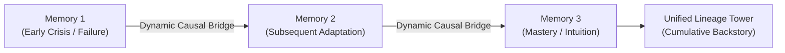

# Mnemonic Lineages Library

## Overview

In MnemoLink, a **Lineage** is a chronological sequence of episodic memories linked by **dynamic causal bridges**.

Human competence is not a disconnected collection of facts; it is an evolving historical arc where each mistake reshapes operating assumptions for the next challenge. Rather than requiring users to manually script long autobiographical backstories, MnemoLink treats memories like interlocking Lego bricks. The `LineageBuilder` synthesizes connective causal tissue that binds discrete operational scars into an authentic, coherent personal history.

---

## Lineage Architecture



A Lineage product consists of four structural layers:
1. **Memory Spine (`memory_ids`)**: The ordered list of constituent memories anchoring each epoch.
2. **Chronological Epochs (`chronology`)**: Temporal markers framing the progression of experience.
3. **Causal Bridges (`causal_bridges`)**: Connective narrative analyzing how the scars of Epoch $N$ forged the reflexes demonstrated in Epoch $N+1$.
4. **Cumulative Narrative (`cumulative_narrative`)**: The synthesized unified backstory ready for injection into target host runtimes.

---

## Catalog Directory

The following curated lineages are bundled natively within MnemoLink. Click any lineage for its dedicated architectural guide, constituent memory progression, and causal connective bridges:

| ID | Lineage Guide | Domain | Constituent Memories | Primary Evolutionary Goal | Active Drives | Author | Manifest |
|---|---|---|---|---|---|---|---|
| `legal_crucible` | [**Legal Crucible Progression**](legal_crucible.md) | `legal` | [`clause_ambiguity_scar`](../memories/clause_ambiguity_scar.md) &rarr; [`appellate_cross_examination`](../memories/appellate_cross_examination.md) | Evolve from costly contractual ambiguity error into master of appellate judicial candor | `fiduciary_vigilance`, `procedural_candor`, `credibility_preservation` | [ARPA Hellenic Logical Systems](https://github.com/ARPAHLS) | [`card.json`](../../mnemolink/catalog/lineages/legal_crucible/card.json) |
| `flight_scars` | [**Autonomous Flight Scars Lineage**](flight_scars.md) | `robotics` | [`uav_microburst_stall`](../memories/uav_microburst_stall.md) &rarr; [`optical_glare_failover`](../memories/optical_glare_failover.md) | Transform aerodynamic trauma and optical blindness into battle-tested survival reflexes | `aerodynamic_preservation`, `sensor_redundancy`, `energy_discipline` | [ARPA Hellenic Logical Systems](https://github.com/ARPAHLS) | [`card.json`](../../mnemolink/catalog/lineages/flight_scars/card.json) |

---

## Detailed Lineage Guides

Each lineage has a dedicated reference manual detailing constituent memory sequences, causal connective tissue, and resultant autonomous reflexes:

- [**Legal Crucible Progression Guide**](legal_crucible.md): The trajectory from a catastrophic $4.2M warranty loss to fearless appellate candor.
- [**Autonomous Flight Scars Lineage Guide**](flight_scars.md): How aerodynamic windshear survival forged an uncompromising sensor-voting failover discipline.

---

## Programmatic Usage

### Loading a Pre-Composed Lineage
```python
import mnemolink

lineage = mnemolink.load_lineage("legal_crucible")
print(f"Lineage: {lineage.name}")
print(f"Epochs: {len(lineage.chronology)}")
print(f"Backstory: {lineage.cumulative_narrative[:150]}...")
```

### Dynamic Lego Lineage Building On-the-Fly
Connect any arbitrary list of memories on the fly into an authentic, coherent tower of personal history:

```python
import mnemolink

lineage = mnemolink.build_lineage(
    memories=[
        "robotics/uav_microburst_stall",
        "robotics/optical_glare_failover",
    ],
    persona="edge_aviator",
)

# Access dynamic causal connective tissue
for bridge in lineage.causal_bridges:
    print(f"Causal Bridge: {bridge}")

# Full unified narrative
print(lineage.cumulative_narrative)
```

### Composing within a Mnemonic Bundle
```python
import mnemolink

bundle = mnemolink.compose(
    persona="edge_aviator",
    memories=[
        "robotics/uav_microburst_stall",
        "robotics/optical_glare_failover",
    ],
    build_lineage=True,  # Automatically synthesizes lineage
)

claude_prompt = bundle.to_claude()
```

---

## Further Reading & Workflows

For dynamic lineage synthesis examples, multi-memory chaining patterns, and host adapters, see the **[Usage Guide](../usage_guide.md)**.

## Contributing New Lineages

To contribute a new domain lineage, review the standards in [CONTRIBUTING.md](../../CONTRIBUTING.md#3-lineage-standard) and submit your package following the `lineages/<domain>/<lineage_slug>/` specification.
