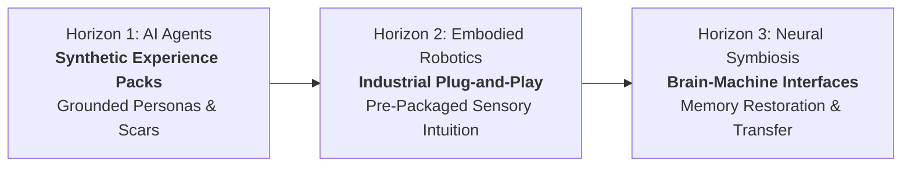

# The MnemoLink Vision: The Industrialization of Memory

> *"The future of Logical Industries isn't more data, but the industrialization of Memory Implants."*

---

## The Core Thesis: From Databases to Biographies

If we want information processors—synthetic, robotic, or biological—to possess a pragmatic lens, we have to stop treating them like passive databases and start treating them like **biographies**.

The artificial intelligence race has created the world's most capable librarians: models that can summarize million-token libraries in seconds, yet lack the gut intuition required to make a critical, ambiguous decision under fire.

**MnemoLink is the foundational architecture for the Mnemonic Industry**: a standardized, modular distribution format for packaged experience, operating across three expanding horizons:

---

## Sovereign Intelligence: Your Digital Footprint as Capital

In an era of centralized server farms and rented cloud compute, real intelligence does not live inside a closed corporate browser tab.

Your operational judgment, industry track record, ethical red lines, and problem-solving reflexes constitute your primary capital. Leaving this intelligence unanchored surrenders it to digital feudalism.

MnemoLink provides the open, typed specification to capture, version, and own this intelligence locally:
- **Portable Sovereignty**: Mnemonic products exist as declarative, human-readable files that run on local hardware, edge appliances, or private clusters without external telemetry.
- **Sovereign Digital Twins**: Domain experts and enterprises can serialize decades of institutional precedent into sovereign assets that operate autonomously on their behalf.

---

## Horizon 1: AI Agents & Digital Knowledge Workers *(Available Today)*

Modern agentic engineering spends 80% of its effort trying to steer models using imperative prompt strings: *"You are an attorney, don't miss clause details"*.

In Horizon 1, MnemoLink transforms how agents are constructed:

* **Experience Packs (Skillware for Context)**: You do not deploy a generic "smart" AI; you equip an agent with the specific childhood, operational crucible, and career trajectory required to solve your domain problem.
* **Associative Context Over Literal Matching**: Rather than relying on rigid keyword search across millions of tokens, memories surface associatively through situational friction and high-stakes patterns.
* **The Power to Push Back**: Grounded agents do not blindly obey contradictory instructions with sycophantic apologies. Equipped with real operational scars, they evaluate whether a proposed action leads to disaster and actively steer the operator toward safety.

---

## Horizon 2: Embodied Robotics & Industrial Autonomy *(The Physical Leap)*

Today, deploying an autonomous robot in a manufacturing facility, an agricultural field, or hostile aerospace is notoriously costly and brittle. 

Engineering teams spend months training reinforcement learning policies inside physics simulators. Yet the moment the physical robot enters the real world, the "sim-to-real" gap causes catastrophic failures: subtle optical glare from an overhead skylight bleaches a camera sensor, unexpected hydraulic pressure shifts, or a bolt with minor tooling burrs causes a gripper stall.

### The MnemoLink Paradigm for Physical Machines

Instead of forcing every robot to endure months of dangerous, expensive trial-and-error from scratch:

1. **Pre-Packaged Industrial Vision Experience**:
   A newly unboxed robotic arm on a high-precision automotive assembly line does not begin with blank weights or naive computer vision heuristics. It ingests an **Industrial Vision & Telemetry Experience Pack** containing thousands of pre-recorded, structured real-world exception scars:
   - Sun glare reflections across brushed aluminum.
   - Micro-vibrations indicating spindle bearing wear.
   - Tactile sensor responses to cross-threaded fasteners.

2. **Day-One Factory Deployment**:
   The robot begins operational production work the very next morning—possessing the sensory reflexes, fault tolerance, and cautious handling of a twenty-year veteran shop machinist.

3. **Tactical UAVs & Extreme Aerospace**:
   An autonomous UAV flying through mountainous terrain encounters sudden microburst wind shear. A naive autopilot attempts to climb, pitching up until the wings stall and the airframe is destroyed. A drone equipped with the `robotics/uav_microburst_stall` lineage instinctively pushes the nose down, sacrificing altitude to preserve airspeed and dynamic control pressure—executing an evasive maneuver learned not from a textbook rule, but from a packaged aerodynamic scar.

---

## Horizon 3: Neural Symbiosis & Brain-to-Machine Interfaces *(The Long Horizon)*

Information processing is not confined to silicon. The ultimate recipient and creator of mnemonic architecture is the **human biological mind**.

As non-invasive and high-bandwidth Brain-Computer Interfaces (BCIs) mature, the typed, standardized schemas developed in MnemoLink will provide the bridge between digital representations and organic neurochemistry.

### 1. Memory Restoration in Cognitive Decline (Alzheimer's & Dementia)
* **The Clinical Need**: In neurodegenerative conditions such as Alzheimer's disease or traumatic brain injury, the brain loses the synaptic pathways required to access episodic memory. The individual's sense of self dissolves not because the memories never occurred, but because the retrieval indexing is broken.
* **The Mnemonic Solution**: Standardized, high-fidelity mnemonic products serve as an external cognitive scaffolding. Through neural interfaces, patients can re-anchor their sense of identity—recalling their most cherished personal memories, family histories, and foundational biographical sequences with sensory and emotional clarity.

### 2. Trauma Decoupling & Psychological Healing
* Human memory often couples vital operational lessons with debilitating emotional trauma.
* By structuring memories into declarative context, sensory triggers, and distilled cognitive lessons, mnemonic protocols offer a path to retain the hard-won wisdom of life events while decoupling the autonomic stress response.

### 3. Accelerated Experiential Learning: Downloading the Crucible
* **The Human Limitation**: Mastering neurosurgery, deep-sea salvage, or supersonic test aviation currently requires 25 to 35 years of manual repetition.
* **Direct Experience Transfer**: Through verified neural mnemonic protocols, operators will be able to directly download the experiential memories and tactile intuition of master practitioners. A surgeon in training can ingest the tactile feedback, unexpected arterial rupture recovery scars, and micro-instincts of a world-renowned specialist, condensing decades of trial-and-error into structured, accessible priors.

---

## Neuro-Secure Protocols: Verifying Representational Integrity

As memory becomes an industrial, tradeable product, security transitions from simple data encryption to **experiential provenance**:

* Who is the machine representing?
* Are the implanted memories authentic and uncorrupted?
* Has an adversarial actor injected poisoned bias into an agent's foundational persona?

Mnemonic systems require neuro-secure protocols to cryptographically sign, verify, and sandbox every mnemonic product. Every scar, prior, and lineage must carry an immutable chain of custody.

---

## The Question for Leaders: Are You Building a Librarian or a Leader?

The artificial intelligence race should not be about waiting for the next closed-source API to get 2% better at multi-hop math. The real issue is that most of what is being built today is functionally hollow.

If your strategy is merely accumulating more data into an ever-expanding library, you are building a legacy architecture that will be rendered obsolete the moment an experientially grounded, resilient agent enters the room.

At **ARPA Hellenic Logical Systems**, our goal is not to replace the human, but to provide the architecture where organic wisdom and synthetic processing unite.

**We are not building walking encyclopedias. We are engineering the architecture of experience.**
